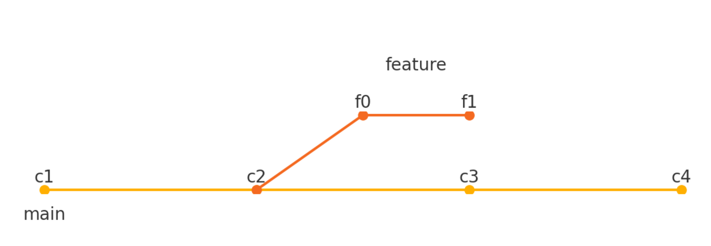

# Git & GitHub - Guía Detallada

## Introducción

Git es un sistema de control de versiones distribuido. GitHub es una plataforma basada en la web para alojar repositorios Git, colaborar y compartir código. Usar Git y GitHub te permite controlar versiones, trabajar en equipo y mantener tu código seguro y organizado.

## Instalación de Git

1. Ve a [git-scm.com](https://git-scm.com) y descarga el instalador para tu sistema operativo.  
2. Sigue el asistente de instalación.  
3. Verifica la instalación con:

```bash
git --version
```

## Configuración Inicial

Antes de usar Git, configura tu identidad:

```bash
git config --global user.name "Tu Nombre"
git config --global user.email "tu@correo.com"
```

Esto se guarda en `~/.gitconfig` y se usará en todos tus commits.

## Crear un Repositorio

Puedes iniciar un nuevo repositorio con:

```bash
git init
```

Esto crea una carpeta `.git` donde Git almacenará el historial del proyecto.

## Ciclo Básico de Trabajo

1. `git status` - Verifica el estado del proyecto  
2. `git add archivo` - Prepara un archivo para ser confirmado (commit)  
3. `git commit -m "Mensaje"` - Guarda los cambios en el historial  
4. `git log` - Muestra el historial de commits  
5. `git diff` - Muestra diferencias entre versiones

## Repositorios Remotos y GitHub

Para conectar tu proyecto local a GitHub:

1. Crea un nuevo repositorio en [github.com](https://github.com)  
2. En la terminal:

```bash
git remote add origin https://github.com/usuario/repositorio.git
git branch -M main
git push -u origin main
```

Ahora tu proyecto está vinculado a GitHub. Puedes subir cambios con `git push` y obtener cambios con `git pull`.

## Uso de Ramas (Branching)

Las ramas permiten trabajar en funcionalidades nuevas sin afectar el código principal:

```bash
git branch nueva-rama     # Crea una nueva rama
git checkout nueva-rama   # Cambia a esa rama
git merge otra-rama       # Fusiona los cambios de otra rama
git branch -d rama        # Elimina una rama
```

Esto es ideal para trabajar en equipo o desarrollar nuevas features sin romper nada.

## Buenas Prácticas

- Usa mensajes de commit descriptivos.  
- No trabajes directamente en `main`. Usa ramas.  
- Haz `pull` antes de `push` para evitar conflictos.  
- Revisa tus cambios con `git diff` antes de hacer commit.

## Ejemplo Visual de Ramas

En este diagrama, vemos cómo una rama `feature` se desprende de la rama principal `main` y luego se fusiona. Esto permite trabajar en paralelo sin conflictos.


